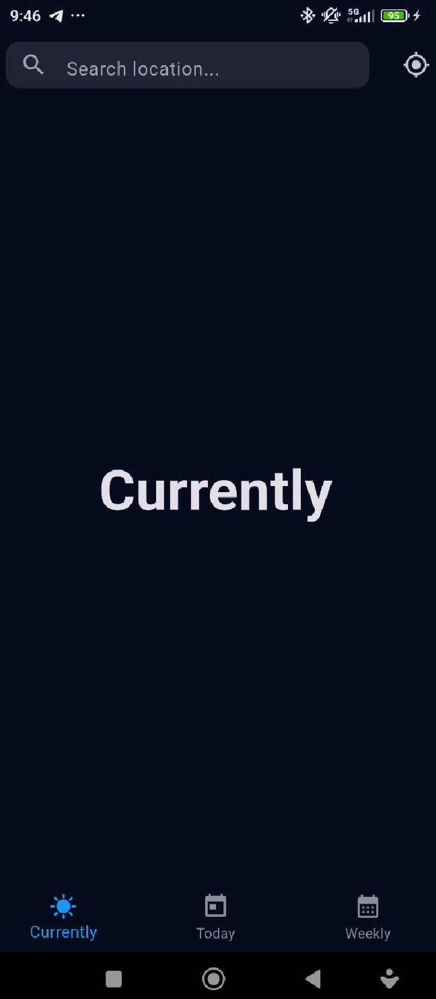
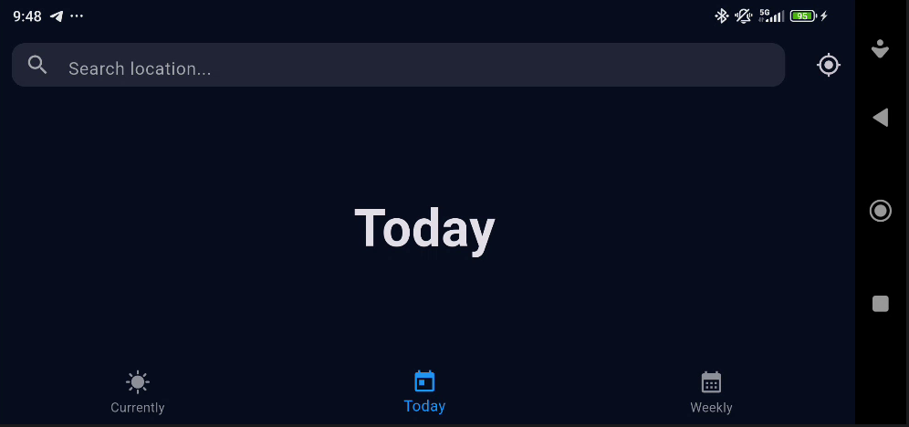

# 🌦️ Weather App - Phase 1: UI & Navigation

Este proyecto es la primera fase del desarrollo de una aplicación meteorológica completa. En esta etapa, nos centramos exclusivamente en la **interfaz de usuario (UI)** y la **navegación estática**.

---

## 🎨 Características de la Interfaz

### 1. Barra de Búsqueda Dinámica
Ubicada en la `AppBar`, permite al usuario introducir nombres de ciudades.
*   **Icono de Lupa**: Indicador visual de búsqueda.
*   **Acción**: Al presionar "Enter", la aplicación captura el texto y actualiza el estado visual para confirmar la selección.

### 2. Sistema de Pestañas (Navigation)
Implementado mediante un `BottomNavigationBar` que permite alternar entre tres vistas críticas:
*   **Currently**: Estado actual del tiempo.
*   **Today**: Pronóstico detallado para las próximas horas.
*   **Weekly**: Pronóstico extendido para los próximos 7 días.

### 3. Integración de Geolocalización (Visual)
Un botón dedicado en la parte superior derecha que simula la activación del GPS del dispositivo.

---

## 🛠️ Detalles Técnicos

*   **Widget Principal**: `Scaffold` con `appBar`, `body` y `bottomNavigationBar`.
*   **Gestión de Estado**: Uso de `setState` para actualizar el índice de la pestaña activa (`_currentIndex`) y el texto de búsqueda (`_searchText`).
*   **Diseño**: Uso de `ThemeData.dark()` para una apariencia moderna y profesional.

---

## 📸 Capturas (Concepto)

| Vista Vertical | Vista Horizontal |
|:---:|:---:|
|  |  |

---

## 🚀 Cómo probarlo
1. Asegúrate de tener Flutter instalado.
2. Ejecuta `flutter pub get` para instalar los paquetes necesarios.
3. Usa `flutter run` para lanzar la app en tu emulador o dispositivo físico.
