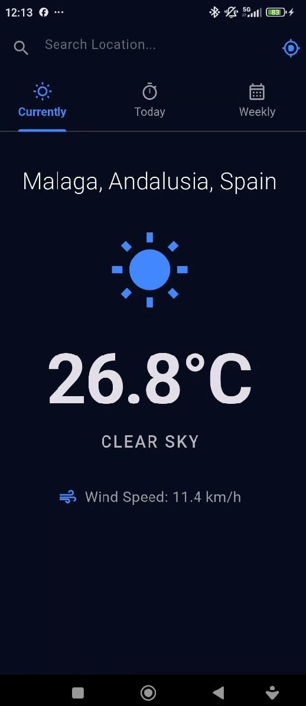
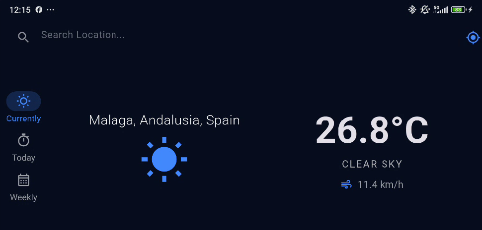
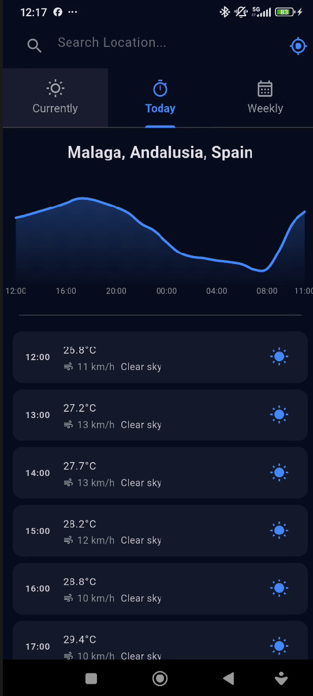
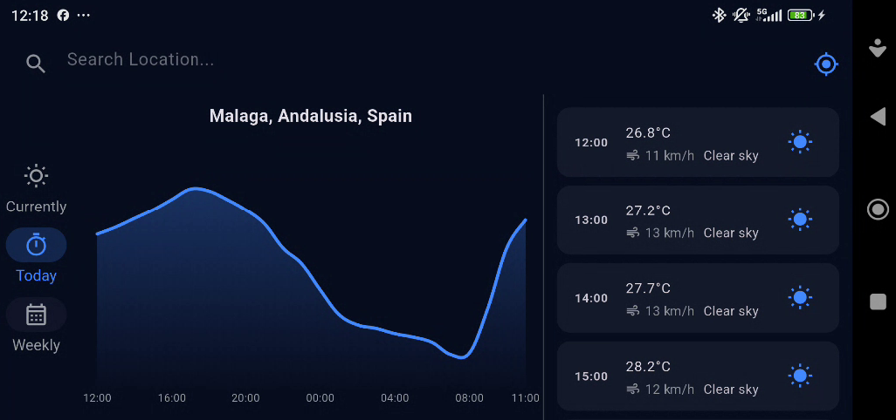
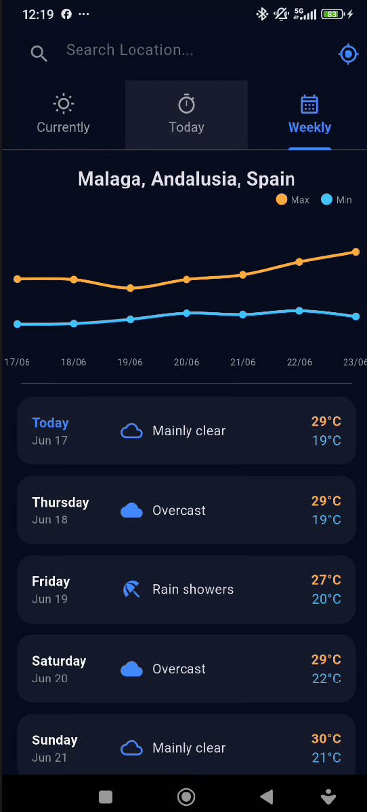
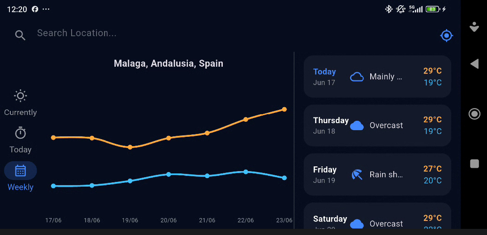
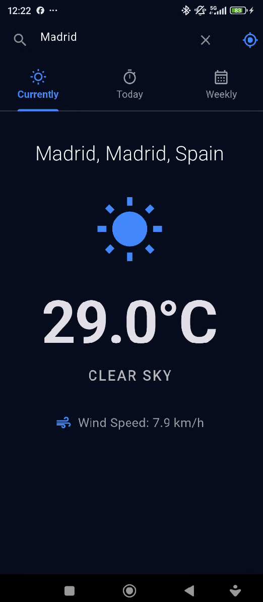
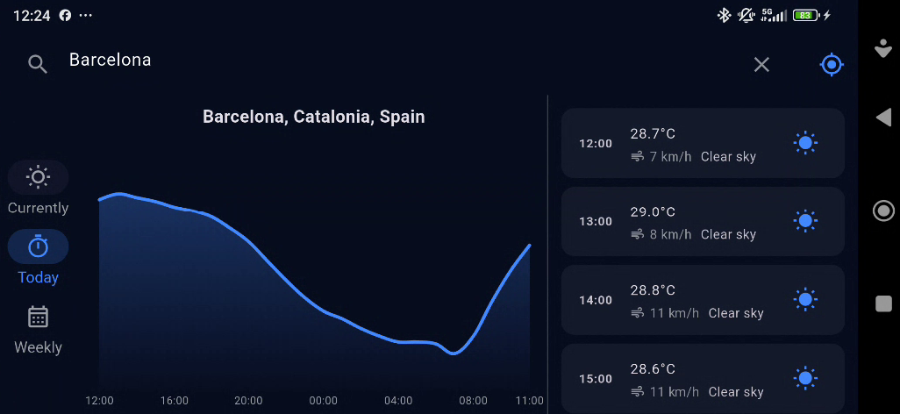
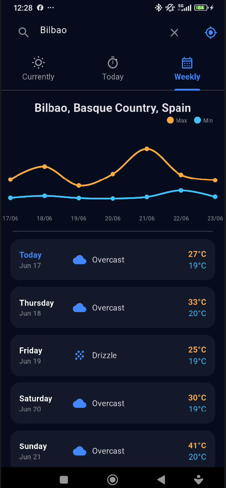

# 📊 Piscine Mobile — Module 03: Advanced Weather App

> **Cuarto módulo de la Piscine Mobile de 42 Málaga.**  
> En este módulo alcanzamos el nivel profesional. No solo pedimos datos a internet y usamos el GPS, sino que transformamos esa información bruta en **conocimiento visual**. Implementamos gráficos dinámicos para mostrar tendencias y pulimos la interfaz de usuario para que se sienta como una aplicación comercial de alta calidad.

---
> 🔗 **[Ir al README General de la Piscine](../README.md)** | **[📖 Guía de Aprendizaje](../FLUTTER.md)**
---

<p align="left">
  
  
  
  
  
</p>

---

## 📑 Índice

- [🗺️ Dónde estamos en el camino](#️-dónde-estamos-en-el-camino)
- [🎯 ¿Qué aprendemos en este módulo?](#-qué-aprendemos-en-este-módulo)
- [📋 Reglas Generales](#-reglas-generales)
- [📱 Visualización (Screenshots)](#-visualización-screenshots)
- [📈 La gran novedad: fl_chart](#-la-gran-novedad-fl_chart)
- [🎨 Diseño Avanzado y Adaptabilidad](#-diseño-avanzado-y-adaptabilidad)
- [🏗️ Estructura del Proyecto](#️-estructura-del-proyecto)
- [📦 Nuevas Dependencias](#-nuevas-dependencias)
- [🔑 Conceptos Clave del Nivel Pro](#-conceptos-clave-del-nivel-pro)
- [✅ Guía de Evaluación (Peer-to-Peer)](#-guía-de-evaluación-peer-to-peer)
- [🛠️ Preparación del Entorno](#️-preparación-del-entorno)

---

## 🗺️ Dónde estamos en el camino

| Módulo | Nombre | Foco Principal |
|--------|--------|----------------|
| **00** | Fundamentals | Widgets básicos y estado simple |
| **01** | Navigation | AppBar, BottomBar y layouts |
| **02** | Medium App | HTTP, JSON y GPS |
| **➡️ 03** | **Advanced App** | **Visualización de Datos, Gráficos y UI Pulida** |

---

## 🎯 ¿Qué aprendemos en este módulo?

El **Module 03** eleva la aplicación a un estándar de producción. Al finalizarlo, habrás dominado:

1.  **Visualización de Datos (Charts):** Cómo usar la librería `fl_chart` para convertir listas de números en gráficos lineales elegantes y comprensibles.
2.  **Navegación con Tabs:** Uso de `TabBar` y `TabBarView` con `TabController` para transiciones laterales fluidas entre vistas.
3.  **UI/UX de Alta Fidelidad:** Implementación de degradados, bordes suavizados (`ClipRRect`), espaciados consistentes y jerarquía visual.
4.  **Diseño Adaptativo (Adaptive Layout):** Cómo detectar la orientación del dispositivo (`MediaQuery`) y cambiar radicalmente la navegación (de Tabs a `NavigationRail`).
5.  **Manejo Avanzado de Errores:** Mensajes de error específicos que guían al usuario y estados de carga pulidos.

---

## 📋 Reglas Generales

Para que el proyecto sea válido, debe cumplir con los mismos estándares de calidad del módulo anterior pero con mayor complejidad:
- **Sin Errores de Compilación**: La app debe arrancar limpiamente.
- **Responsividad Total**: No deben existir desbordamientos de layout, especialmente al rotar la pantalla.
- **Manejo de Contextos Asíncronos**: Uso correcto de `mounted` y gestión de `BuildContext` tras operaciones asíncronas.
- **Gráficos Reales**: Los gráficos deben alimentarse de los datos reales de la API, no de datos estáticos.

---

## 📱 Visualización (Screenshots)

### Interfaz Principal (Modo Retrato)
| Actualmente | Hoy (Detalles) | Semanal (Pronóstico) |
| :---: | :---: | :---: |
|  |  |  |

### Gráficos y Búsqueda
| Evolución Térmica (Hoy) | Gráfico de Máx/Mín | Búsqueda de Ubicación |
| :---: | :---: | :---: |
|  |  |  |

### Diseño Adaptativo (Modo Horizontal)
| Home Landscape | Gráficos en Landscape | Detalle Semanal |
| :---: | :---: | :---: |
|  |  |  |

---

## 📈 La gran novedad: `fl_chart`

En este módulo, el pronóstico horario no es solo una lista; es un **gráfico de tendencias**. Usamos `LineChart` para mostrar cómo subirá o bajará la temperatura en las próximas 24 horas.

**Conceptos clave en el gráfico:**
-   **FlSpot:** Representa un punto (x, y) en el gráfico (Hora vs Temperatura).
-   **isCurved:** Suaviza la línea para que parezca una "ola" meteorológica en lugar de picos serrados.
-   **BelowBarData:** Añade un degradado bajo la línea para dar profundidad visual.
-   **AxisTitles:** Formateo dinámico de las etiquetas de tiempo en el eje inferior.

---

## 🎨 Diseño Avanzado y Adaptabilidad

### TabBar y Transiciones
A diferencia del `BottomNavigationBar` simple, el `TabBar` con `TabBarView` permite al usuario deslizar el dedo (swipe) lateralmente para cambiar de sección. Esto mejora enormemente la experiencia de usuario (UX) al hacer la app más táctil y fluida.

### NavigationRail (Modo Landscape)
Cuando el usuario gira el móvil, las pestañas superiores a menudo consumen demasiado espacio vertical valioso. Implementamos un **NavigationRail** lateral que aprovecha el ancho de la pantalla, manteniendo el contenido principal visible y accesible.

---

## 🏗️ Estructura del Proyecto

```
advanced_weather_app/
│
├── lib/
│   ├── main.dart
│   ├── models/
│   │   └── weather_data.dart
│   ├── services/
│   │   ├── weather_service.dart
│   │   └── location_service.dart
│   ├── screens/
│   │   └── weather_home.dart        ← Gestión de TabController y NavigationRail
│   └── widgets/
│       ├── weather_chart.dart       ← El componente de gráfico especializado
│       ├── currently_view.dart
│       ├── today_view.dart          ← Integra el gráfico horario
│       └── weekly_view.dart         ← Integra el gráfico semanal
└── pubspec.yaml
```

---

## 📦 Nuevas Dependencias

En el archivo `pubspec.yaml` añadimos la herramienta de dibujo:

```yaml
dependencies:
  fl_chart: ^0.70.2  # Potente librería para gráficos en Flutter
```

---

## 🔑 Conceptos Clave del Nivel Pro

### 1. El Mixin `SingleTickerProviderStateMixin`
Para que las animaciones de las pestañas (`Tabs`) funcionen, el estado de nuestra pantalla necesita un "reloj" que sincronice los frames. Usamos este mixin para proporcionar ese `vsync` al `TabController`.

### 2. Mapeo de Datos a Gráficos
Aprendemos a transformar una lista de objetos `HourlyWeather` en una lista de `FlSpot` usando técnicas de mapeo. Es la base de la visualización de datos científica.

### 3. Geocodificación Inversa Profesional
Aprendemos que no todas las APIs lo hacen todo. Usamos **BigDataCloud** como un servicio especializado para obtener nombres de ciudades a partir de coordenadas GPS de forma gratuita y eficiente.

---

## ✅ Guía de Evaluación (Peer-to-Peer)

### 1. Visualización (Gráficos)
- [ ] ¿Aparece un gráfico lineal en la pestaña "Today"?
- [ ] ¿La línea del gráfico es curva (`isCurved: true`)?
- [ ] ¿Hay un degradado bajo la línea?
- [ ] ¿El eje X muestra las horas (Ej: 14:00, 18:00)?

### 2. Navegación Avanzada y Adaptabilidad
- [ ] ¿Se puede cambiar entre pestañas tanto tocando arriba como deslizando el dedo lateralmente?
- [ ] ¿Al rotar a modo horizontal, desaparecen las pestañas y aparece el `NavigationRail` lateral?
- [ ] ¿El cambio de orientación es fluido y no pierde el estado actual de los datos?

### 3. UI y Diseño
- [ ] ¿La vista "Currently" tiene un diseño más visual (iconos grandes, tipografía variada)?
- [ ] ¿Se usan tarjetas (`Card`) o contenedores con bordes redondeados y colores suaves?
- [ ] ¿La app mantiene un tema oscuro consistente y profesional?

### 4. Robustez
- [ ] ¿Muestra mensajes de error claros ante fallos de conexión o GPS?
- [ ] ¿El indicador de carga aparece en cada búsqueda o uso de GPS?

---

## 🛠️ Preparación del Entorno

```bash
# Entrar en la carpeta
cd mobileModule03/advanced_weather_app

# Instalar dependencias (incluyendo fl_chart)
flutter pub get

# Ejecutar
flutter run
```

---

## ✍️ Autor

**[sternero](https://github.com/STC71)** — junio 2026

---

<p align="center">
  <b>Piscine Mobile 42 Málaga</b><br>
  <i>"From basic widgets to professional data visualization"</i>
</p>
