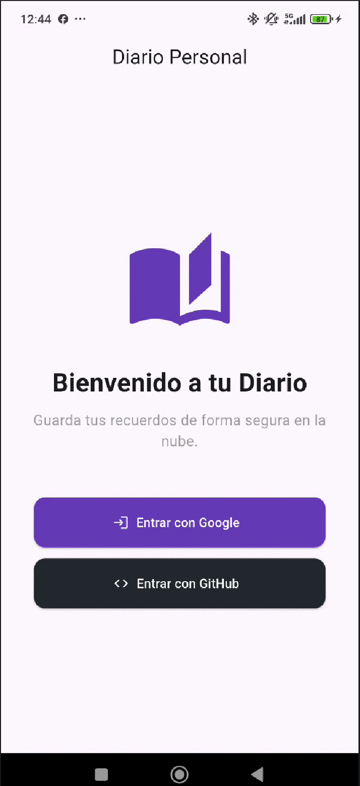
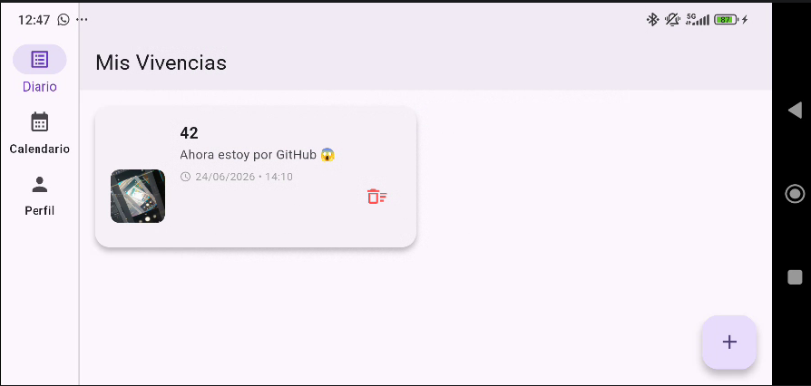
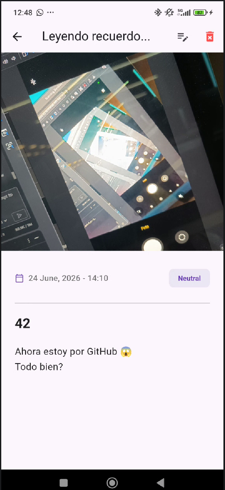
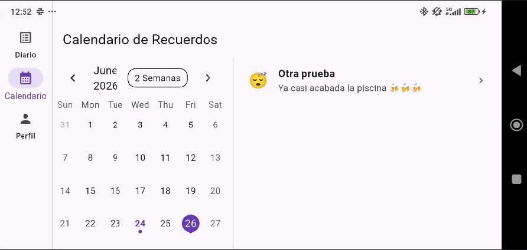
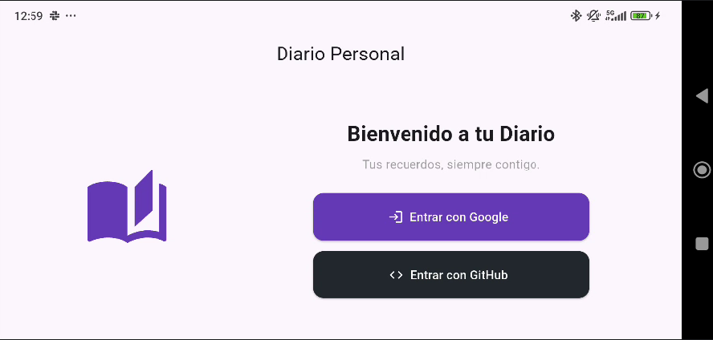

# 📔 Piscine Mobile — Module 05: Advanced Diary App

> **El siguiente paso en la evolución de nuestra aplicación de diario.**  
> En este módulo avanzado, expandimos las capacidades de nuestro diario personal introduciendo una gestión de datos más inteligente, una interfaz de usuario altamente responsiva y herramientas de visualización de datos (calendarios y estadísticas). Todo ello, manteniendo la potencia de **Firebase** como motor de nuestra nube.

---
> 🔗 **[Ir al README General de la Piscine](../../README.md)** | **[📖 Guía de Aprendizaje](../../FLUTTER.md)** | **[⚙️ Configuración Firebase](../../CONFIG.md)**
---

<p align="left">
  
  
  
  
  
</p>

---

## 📑 Índice

- [🗺️ El camino recorrido](#️-el-camino-recorrido)
- [🎯 Novedades del Módulo 05](#-novedades-del-módulo-05)
- [🏗️ Arquitectura y Estructura](#️-arquitectura-y-estructura)
- [✨ Características Principales](#-características-principales)
- [📊 Visualización de Datos](#-visualización-de-datos)
- [📱 UX y Diseño Adaptativo](#-ux-y-diseño-adaptativo)
- [✅ Requisitos de Evaluación](#-requisitos-de-evaluación)
- [🛠️ Guía de Inicio Rápido](#️-guía-de-inicio-rápido)

---

## 🗺️ El camino recorrido

| Módulo | Nombre | Foco Principal |
|--------|--------|----------------|
| **00-03** | Basics & Advanced | UI, HTTP, Gráficos y Sensores |
| **04** | Final Project | Integración con Firebase (CRUD & Auth) |
| **➡️ 05** | **Advanced Diary** | **Calendarios, Estadísticas y UX Adaptativa** |

---

## 🎯 Novedades del Módulo 05

El **Module 05** no solo repite lo aprendido, sino que lo perfecciona. Los pilares de esta entrega son:

1.  **Navegación Multimodal:** Implementación de un `Drawer` global y un sistema dual de navegación (`BottomNavigationBar` para móviles y `NavigationRail` para tablets/landscape).
2.  **Vista de Calendario Inteligente:** Integración de `table_calendar` con marcadores reactivos que indican qué días tienen vivencias guardadas.
3.  **Análisis de Sentimientos:** Un sistema de estadísticas que procesa en tiempo real el estado de ánimo predominante del usuario.
4.  **Optimización de Consultas:** Filtrado avanzado en Firestore para permitir búsquedas por fecha sin sacrificar el rendimiento.

---

## 📱 Visualización (Screenshots)

### Interfaz Principal (Modo Retrato)
| Acceso (Login) | Diario (Feed) | Calendario |
| :---: | :---: | :---: |
|  |  |  |

### Gestión y Análisis
| Estadísticas | Editor de Vivencias | Detalle del Recuerdo |
| :---: | :---: | :---: |
|  |  |  |

---

---

## 🏗️ Arquitectura y Estructura

El proyecto se ha organizado para ser mantenible y fácil de entender:

```
advanced_diary_app/
│
├── lib/
│   ├── main.dart                ← Guardián de Auth y punto de arranque.
│   ├── home_page.dart           ← Orquestador de navegación (Tabs + Drawer).
│   ├── diary_feed_page.dart     ← El muro principal con todas las entradas.
│   ├── calendar_page.dart       ← Visualización temporal de recuerdos.
│   ├── profile_page.dart        ← Centro de control del usuario y stats.
│   ├── entry_editor_page.dart   ← Formulario avanzado (Cámara, Fecha, Emojis).
│   ├── details_page.dart        ← Vista de lectura inmersiva con Hero animations.
│   └── stats_page.dart          ← Lógica de procesamiento de datos.
│
└── pubspec.yaml                 ← Dependencias (Firebase, Calendar, ImagePicker).
```

---

## ✨ Características Principales

### 🔐 Autenticación Robusta
- Inicio de sesión con **Google** y **GitHub**.
- Persistencia de sesión (el usuario no tiene que loguearse cada vez).
- Cierre de sesión centralizado en el menú lateral y perfil.

### 📝 Gestión de Vivencias (CRUD)
- **Crear**: Escribe títulos, descripciones y asocia una foto.
- **Leer**: Visualización clara con scroll fluido.
- **Editar**: Modifica cualquier recuerdo pasado, incluyendo la fecha o la imagen.
- **Eliminar**: Borrado seguro de datos en Firestore e imágenes en Storage.

### 📸 Multimedia
- Captura fotos directamente con la cámara del dispositivo.
- Selecciona imágenes de la galería.
- Carga asíncrona con indicadores de progreso.

---

## 📊 Visualización de Datos

### Calendario de Recuerdos
- Permite filtrar entradas seleccionando un día específico.
- Los días con contenido aparecen destacados en **negrita** y con un **punto indicador**.
- Soporta formatos de vista por mes, semana o quincena.

### Estadísticas de Ánimo
- Procesamiento en tiempo real de los sentimientos registrados.
- Representación mediante barras de progreso porcentuales.
- Conteo total de vivencias para motivar la escritura diaria.

---

## 📱 UX y Diseño Adaptativo

La aplicación ha sido diseñada para verse bien en cualquier situación:
- **Modo Portrait:** Layouts verticales optimizados para el uso con una mano.
- **Modo Landscape:** Uso de columnas paralelas y `NavigationRail` para aprovechar el ancho de pantalla.
- **Transiciones:** Uso de `Hero animations` para que las imágenes "vuelen" de la lista al detalle, creando una sensación de fluidez profesional.

---

## ✅ Requisitos de Evaluación

Si estás evaluando este proyecto, asegúrate de verificar:
- [ ] **Acceso:** ¿Funciona el login con Google/GitHub?
- [ ] **Sincronización:** ¿Al añadir una nota en el diario, aparece el marcador en el calendario automáticamente?
- [ ] **Multimedia:** ¿Se suben y visualizan correctamente las fotos?
- [ ] **Adaptabilidad:** ¿Cambia la interfaz correctamente al girar el dispositivo?
- [ ] **Limpieza:** ¿Se borran las imágenes de la nube al eliminar una nota?

---

## 🛠️ Guía de Inicio Rápido

1.  **Clonar y Preparar:**
    ```bash
    flutter pub get
    ```
2.  **Configuración nativa:** Asegúrate de tener tu archivo `google-services.json` en `android/app/`.
3.  **Ejecutar:**
    ```bash
    flutter run
    ```

---

## ✍️ Autor

**[sternero](https://github.com/STC71)** — junio 2026

---

<p align="center">
  <b>Piscine Mobile 42 Málaga</b><br>
  <i>"Llevando Flutter a un nivel superior"</i>
</p>
